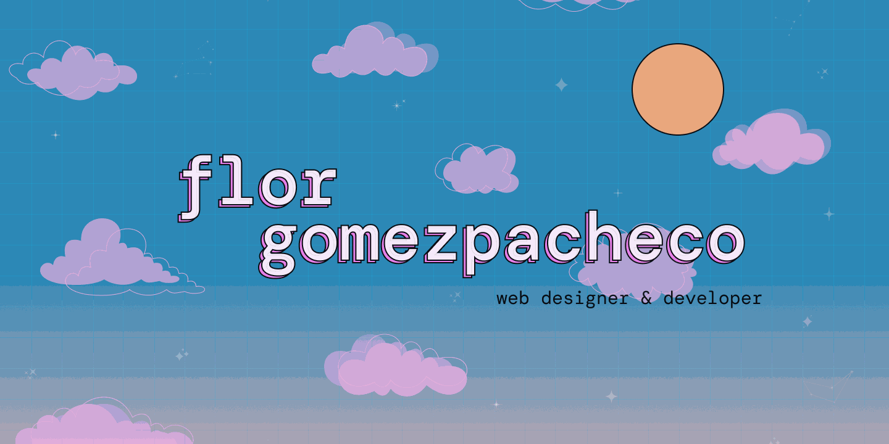

  

<h1 align="center">✨ Hola, soy Flor 👩‍💻</h1>

Web Designer & Developer | UX Lover | Exploradora visual y de código

---

## <picture></picture> **About me**

<picture> </picture>

- 💻 Analista de Sistemas en formación  
- ✨ Apasionada por el diseño accesible, las estéticas y las pequeñas animaciones
- 🛠 Trabajo con HTML, CSS, JS, PHP, Laravel y MySQL
- 💜 Explorando React y proyectos con enfoque emocional
- 📚 Siempre aprendiendo algo nuevo: UX, testing, SAP, LSA…
  

---

## <b> Tecnologías & Herramientas</b>
 

- **Lenguajes y frameworks**:

  
  
  
  
  
  
  

 

- **Diseño & Creatividad**:

  
  
  

 

- **Otras herramientas**:

  
  
  

---

## 🌙 Bonus

> Estoy creando una app donde las personas pueden asociar canciones con imágenes que evocan emociones y recuerdos.  
> Se llama **Memotune**, y combina lo mejor de Pinterest, Tumblr y la música 🎧💜

---

<!-- Créditos o última edición -->
<!-- Última edición: 24/07/2025 -->

